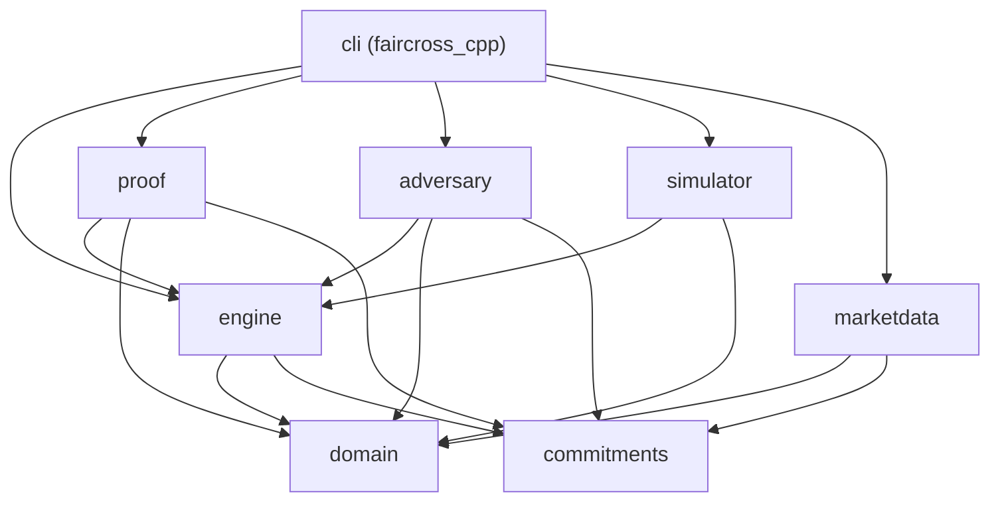

# FairCross technical walkthrough

## 1. Executive Summary

**FairCross** is a research-grade, zero-floating-point frequent-batch exchange engine written in C++20 with no third-party dependencies. Its plaintext checker and transparent research harness make the following procedural-fairness invariants explicit and testable:
- Every eligible committed order is accounted for without operator censorship or front-running;
- The clearing algorithm is bitwise deterministic with zero floating-point arithmetic;
- Allocations follow published pro-rata largest remainder rules without favoritism;
- Cash balances and asset inventories are strictly conserved;
- Multi-batch exchange sessions bind their history with a compact native hash-chain accumulator; this is not a recursive, zero-knowledge, or succinct cryptographic proof.

---

## 2. Architectural Blueprint (8 Modules)

Dependencies run in one direction only. `domain` and `commitments` know nothing about the engine; the engine knows nothing about proving. This is what lets a circuit be checked against an already-tested plaintext invariant rather than becoming a second, subtly different exchange.

| Module | Responsibility | Key Types / Functions |
|---|---|---|
| `domain` | Strongly-typed discrete primitives, zero-float arithmetic | `Price`, `Qty`, `Money`, `Order`, `Ledger`, `ReferencePriceSnapshot` |
| `engine` | Deterministic clearing, pro-rata allocation, atomic state transitions | `determine_clearing_outcome`, `allocate_batch`, `execute_batch`, `verify_transition` |
| `commitments` | Cryptographic order hashing and complete-input Merkle trees | `Sha256Scheme`, `MerkleTree`, `BatchHeader`, `verify_complete_input_accounting` |
| `adversary` | 12-vector malicious operator attack matrix & mutation suite | `AdversarialOperator`, `run_attack_matrix`, `AttackMatrixRunner` |
| `proof` | Transparent in-tree R1CS constraint compiler/checker and native running-state accumulator | `SingleBatchProver`, `RecursiveSessionProver`, `RunningState`, `ConstraintSystem` |
| `simulator` | Agent population (MM / Noise traders), multi-interval partition engine | `SyntheticOrderFlowSimulator`, `BatchIntervalPartitionEngine`, `MarketQualityCalculator` |
| `marketdata` | Nasdaq TotalView-ITCH 5.0 binary parser, L3 order book, oracle bridge | `ItchStreamParser`, `L3OrderBook`, `ItchReplayEngine`, `MarketDataOracleSigner` |
| `cli` | CLI runner for verification, attack evaluation, and proving | `faircross_cpp run`, `attack-matrix`, `prove`, `prove-session` |

---

## 3. Four core engineering and cryptographic decisions

### Decision 1: Strict Integer Arithmetic (Zero-Float Rule)
- **Why**: Standard IEEE-754 floating-point arithmetic is non-associative, suffers from platform-dependent rounding drift, and induces constraint explosion in constraint systems.
- **Implementation**: Fixed discrete units:
  - Prices: $10^{-4}\text{ USD}$ (integer ticks as `std::uint64_t`).
  - Quantities: integer lots (`std::uint64_t`).
  - Cash balances: integer smallest units (`unsigned __int128`).
- **Pro-Rata Integer Division**: Uses non-overflowing 128-bit multiplication `(q_i * executable_volume) / marginal_volume` with largest-remainder deterministic tie-breaking.

### Decision 2: Complete-Input Accounting vs. Selective Auditing
- **Why**: Traditional verifiable exchanges only prove fills for executed trades, allowing malicious operators to silently drop or front-run unfavorable client orders.
- **Implementation**: Every submitted order is bound to a leaf in a SHA-256 Merkle tree. During clearing, the engine must produce an explicit disposition record (`Filled`, `Unfilled`, or `Rejected`) with a cryptographic Merkle inclusion proof for **100% of leaves** in the tree.

### Decision 3: Native History Accumulation (Research Harness)
- **Why**: A running hash-chain gives a deterministic, compact record of session history for experiments without claiming a production recursive proving system.
- **Implementation**: State transitions are structured as a step tuple $S_k = (k, \mathcal{R}_k, \mathcal{C}_k, P_k^*, Q_k^*, \text{Hash}(\mathcal{L}_k))$ chained into $H_k = \text{Hash}(H_{k-1} \parallel S_k)$. At $K=50$, the raw artifact records 2,800 bytes of independent per-batch artifacts and a 122-byte native accumulator certificate (22.95x ratio). The certificate binds the history data, while verification replays the step proofs; it is not an IVC/SNARK proof.

### Decision 4: Keep Transparent Cost Measurements Separate from Future Cryptographic Proving
- **Why**: The current cost artifact measures only in-tree R1CS synthesis and certificate work, not polynomial arithmetic, MSM, or any SNARK/IVC backend.
- **Implementation**: `proof-cost-model` records 16 microseconds for a 37-constraint single-batch model and modeled session duty cycles from 0.003% to 0.037% over its recorded interval rows. These are controlled prototype measurements and do not establish production or cryptographic proving performance.

---

## 4. Key Measured Empirical Results

All claims are backed by raw reproducible datasets in `experiments/results/`:
1. **Adversarial Operator Robustness (12 total vectors)**:
   - Evaluated 11 malicious operator mutations (cash/inventory creation, order omission, allocation and price manipulation, overfill, limit violation, Merkle spoofing, stale oracle, and post-state forgery) plus 1 honest baseline.
   - **Result**: All 11 malicious cases were rejected and the honest control passed (`experiments/results/attack_evidence_table.json`).
2. **Transparent R1CS Scaling**:
   - Transparent in-tree R1CS synthesis measured 37 constraints for $N=2$ and 793 for $N=64$; recorded prove times were 50 and 991 microseconds respectively (`experiments/results/zk_proof_scaling_benchmark.json`).
3. **Native History-Accumulator Comparison**:
   - At $K=50$, the artifact records 2,800 independent bytes versus a 122-byte native accumulator certificate (22.95x ratio). This compares storage records; it does not demonstrate recursive IVC, zero knowledge, or constant verification (`experiments/results/zk_recursive_vs_independent_comparison.json`).
4. **Market Microstructure & Transparent Cost Model**:
   - The current interval artifact contains 15 runs over 3 seeds and reports batch counts, fills, submitted volume, and cleared volume for 10–500 ms intervals. The separate cost artifact reports transparent in-tree constraint/certificate work only; neither artifact establishes stable fill rates or cryptographic proving duty cycle.

---

## 5. Design questions

### Q1: How does FairCross ensure that pro-rata allocation does not lose or create fractional lots?
**Answer**: FairCross implements the *Hamilton-Hare Largest Remainder Method* using 128-bit integer arithmetic.
1. For each order $i$ in the marginal bucket, base fill is computed as $f_i = \lfloor (q_i \cdot Q^*) / Q_{\text{marginal}} \rfloor$.
2. The remainder is $r_i = (q_i \cdot Q^*) \pmod{Q_{\text{marginal}}}$.
3. The remaining unassigned lots $R = Q^* - \sum f_i$ are distributed one-by-one to orders sorted descending by $r_i$, using ascending `OrderId` as a deterministic tie-breaker. This guarantees $\sum (\text{fills}) = Q^*$ with zero fractional drift.

### Q2: Why is complete-input accounting necessary in a frequent-batch auction?
**Answer**: In a dark pool or off-chain matching engine, the operator can see the order book before clearing. Without complete-input accounting, the operator can drop an eligible buy order that would have cleared at price $P^*$, replacing it with their own proprietary order (front-running/censorship). By requiring a committed Merkle tree root *before* clearing and checking an inclusion proof and disposition for every leaf, the transparent harness detects omission relative to that root.

### Q3: What is the exact mathematical structure of the native history accumulator?
**Answer**: Each batch transition produces a state step tuple $S_k = (k, \mathcal{R}_k, \mathcal{C}_k, P_k^*, Q_k^*, \text{Hash}(\mathcal{L}_k))$. The running accumulator is computed as $H_k = \text{Hash}(H_{k-1} \parallel S_k)$ where $H_0 = 0$. The in-tree verifier independently replays each step proof, checks ledger-root continuity, and recomputes the hash chain. This provides deterministic history binding, not a recursive IVC or a succinct/zero-knowledge proof.

### Q4: What are the explicit threat model limitations of FairCross?
**Answer**:
1. *Pre-Cutoff Order Secrecy*: Orders are committed as SHA-256 hashes $\text{Hash}(O \parallel r)$. If unencrypted preimages leak before batch cutoff, MEV observers can see order intent. Full threshold MPC or time-lock encryption is outside the core engine.
2. *Network-Layer Dropping*: The verifier only checks inclusion for orders present in the published Merkle root $\mathcal{R}_k$; it cannot prevent an operator from dropping a TCP packet before building $\mathcal{R}_k$.
3. *Cross-Asset Margin*: Currently models spot atomic single-instrument ledger balances; multi-asset portfolio margin lending and liquidations are out of scope.
